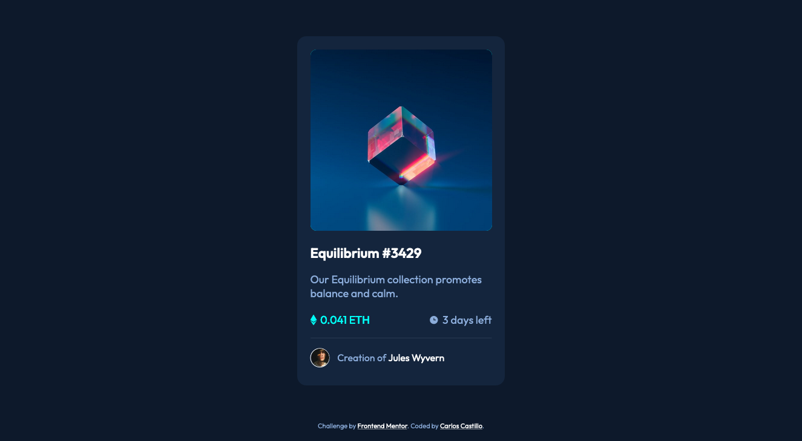

# Frontend Mentor - NFT preview card component solution

This is a solution to the [NFT preview card component challenge on Frontend Mentor](https://www.frontendmentor.io/challenges/nft-preview-card-component-SbdUL_w0U). 

## Table of contents

- [Overview](#overview)
  - [Screenshot](#screenshot)
  - [Links](#links)
- [My process](#my-process)
  - [Built with](#built-with)
  - [What I learned](#what-i-learned)
- [Author](#author)

## Overview

### Screenshot

### Links

- Solution URL: [Solution](https://charliecastleweb.github.io/Frontend-Mentor---nft-preview-card-component/)

## My process

### Built with

- Semantic HTML5 markup
- CSS custom properties
- Flexbox

### What I learned

How to make a nice image transition on hover.

## Author

- Website - [Carlos Castillo](https://carloscastillo.dev/)
- Frontend Mentor - [@CharlieCastleWeb](https://www.frontendmentor.io/profile/CharlieCastleWeb)

